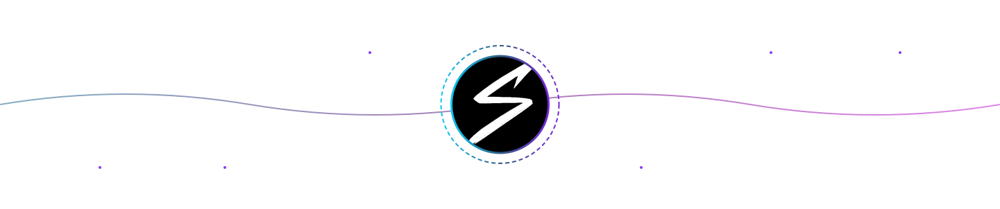

<meta name="viewport" content="width=device-width, initial-scale=1.0">

  <samp>💻 Mobile / Full-Stack Developer</samp> 
  

 

I graduated in Computer Engineering from Wrocław University of Science and Technology (WUST) 🎓 and I'm currently pursuing my master’s degree in Applied Computer Science at WUST. 💻👨‍🎓 I love coding and designing intuitive applications, but outside of programming, I’m also into travelling 🌍, music production 🎵 & sports ⚽🥊 (huge FC Barcelona & MMA fan).

* 🌍  I'm based in Wrocław, Poland
* ✉️  You can contact me at [matisp637@gmail.com](mailto:matisp637@gmail.com)
* ⚡  Fun fact: I have an expensive addiction - I just can’t resist buying more perfumes to expand my collection 🤫
 
 

  
 
  <samp>My Portfolio 👆</samp>

## 🔭 My Biggest Projects

- [**Tripify**](https://github.com/stvshy/tripify) — My most ambitious project to date, a comprehensive travel companion application. Tripify empowers users to visually track and manage their visited countries through an interactive world map and detailed lists, explore rich country profiles packed with information on general facts, weather, travel tips, and safety, and engage with a community by adding friends, managing friend requests, and searching for other users. It also offers personalization features such as custom country rankings, country-specific note-taking, and a light/dark theme system, all supported by secure authentication via email/password (including email verification and password reset) and Facebook login. I am planning to release the application first on the Google Play Store for Android, followed by an iOS version on the App Store. The application is built using React Native with Expo, and utilizes Firebase for its backend services and data management.
     

- [**Web Chatt App**](https://github.com/stvshy/chat-app-aws) — A web messenger-like application for chatting with other users, sending files and notifications. The system is split into microservices (each with its own database) and built using AWS, Docker, Terraform, Java (Spring Boot), and TypeScript.
      

- [**Hollow Depths**](https://github.com/jonasz-lazar-pwr/hollow-depths-game) — 2D pixel-art platformer made in Godot 4.4. Mine underground for resources, manage limited tools, and upgrade your gear in a surface shop. Combines exploration, digging, and strategic resource management. You can play our game here: 👉 [**Click to play!**](https://stvshy.short.gy/game2D)
    

- [**Cinema Reservation System**](https://github.com/Ernest-K/cinema-reservation-system) — A comprehensive cinema ticket reservation system built on a microservices architecture. It allows users to browse movies and screenings (with OMDb ratings), select seats with real-time availability, process reservations and (mock) Tpay payments, generate QR code tickets, and receive email notifications. Developed using Java (Spring Boot), Docker (Compose), Kafka, PostgreSQL, Eureka, and Spring Cloud Gateway.
     

  

## 🛠️ Tech Stack

### Languages & Core Technologies

  
  
  
  
  
  
  
  
  
  
  
  

 

### Frameworks & Libraries

  
  
  
  <picture><source media="(prefers-color-scheme: dark)" srcset="https://cdn.simpleicons.org/nextdotjs/white"><source media="(prefers-color-scheme: light)" srcset="https://cdn.simpleicons.org/nextdotjs/black"></picture>
  
  
  
  <picture><source media="(prefers-color-scheme: dark)" srcset="https://cdn.simpleicons.org/flask/white"><source media="(prefers-color-scheme: light)" srcset="https://cdn.simpleicons.org/flask/black"></picture>
  

 

### Mobile Development

  
  <picture><source media="(prefers-color-scheme: dark)" srcset="https://cdn.simpleicons.org/expo/white"><source media="(prefers-color-scheme: light)" srcset="https://cdn.simpleicons.org/expo/black"></picture>
  

 

### Databases, Cloud & DevOps

  
  
  
  
  
  
  
  
  
  
  <picture><source media="(prefers-color-scheme: dark)" srcset="https://cdn.simpleicons.org/githubactions/white"><source media="(prefers-color-scheme: light)" srcset="https://cdn.simpleicons.org/githubactions/2088FF"></picture>

 

### IDEs & Development Tools

  
  
  
  
  
  
  
  
  
  <picture><source media="(prefers-color-scheme: dark)" srcset="https://cdn.simpleicons.org/cursor/white"><source media="(prefers-color-scheme: light)" srcset="https://cdn.simpleicons.org/cursor/black"></picture>
  <picture><source media="(prefers-color-scheme: dark)" srcset="https://cdn.simpleicons.org/githubcopilot/white"><source media="(prefers-color-scheme: light)" srcset="https://cdn.simpleicons.org/githubcopilot/black"></picture>

 

### Testing, Analysis & Modeling Tools

  
  
  
  
  

 

### Design & Other Software

  
  
  
  
  
  

  

## 🏆 Certifications

- [**CCNA: Introduction to Networks**](https://www.credly.com/badges/9719de3d-0a39-41ad-b203-0c2f3cce6ab7/public_url)  
  *Cisco Networking Academy*
 

  

## 📈 GitHub Stats

  
  

  

  

## 🌐 Socials

  
  &nbsp;&nbsp;&nbsp; 
  <a href="https://www.github.com/stvshy" target="_blank" rel="noreferrer">
    <picture>
      <source media="(prefers-color-scheme: dark)" srcset="https://cdn.simpleicons.org/github/white">
      <source media="(prefers-color-scheme: light)" srcset="https://cdn.simpleicons.org/github/black">
      
    </picture>
  </a>
  &nbsp;&nbsp;&nbsp;
  
  &nbsp;&nbsp;&nbsp;
  <a href="https://www.linkedin.com/in/mateusz-staszk%c3%b3w" target="_blank" rel="noreferrer">
    <picture>
      <source media="(prefers-color-scheme: dark)" srcset="https://raw.githubusercontent.com/danielcranney/readme-generator/main/public/icons/socials/linkedin-dark.svg" />
      <source media="(prefers-color-scheme: light)" srcset="https://raw.githubusercontent.com/danielcranney/readme-generator/main/public/icons/socials/linkedin.svg" />
      
    </picture>
  </a>

  

