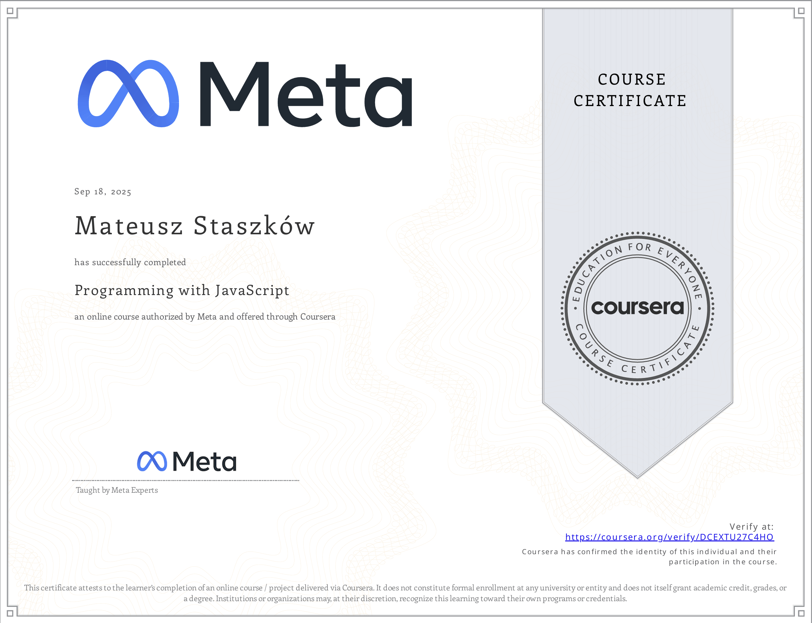

 

  
  
 
  
  

 

I graduated in Computer Engineering from Wrocław University of Science and Technology (WUST) 🎓 and I'm currently pursuing my master’s degree in Applied Computer Science at WUST. 💻👨‍🎓 I love coding and designing intuitive applications, but outside of programming, I’m also into travelling 🌍, music production 🎵 & sports ⚽🥊 (huge FC Barcelona & MMA fan).

* 🌍  I'm based in Wrocław, Poland
* ✉️  You can contact me at [matisp637@gmail.com](mailto:matisp637@gmail.com)
* ⚡  Fun fact: I have an expensive addiction - I just can’t resist buying more perfumes to expand my collection 🤫
 
 

  
 
  <samp>Portfolio 👆</samp>

## 🔭 My Biggest Projects

- [**Tripify**](https://github.com/stvshy/tripify) — My most ambitious project to date, a comprehensive travel companion application currently in active development, aimed at delivering a meticulously polished, market-ready product before launch. The core concept empowers users to track their travel progress, displayed dynamically on an **interactive world map**. Users can create custom rankings for visited and wishlist countries, explore rich **country profiles** with key information, and share their personal travel maps on social media. It features a dedicated **social module** allowing users to add friends, view their profiles, travel achievements, and compare rankings. The platform is supported by **secure authentication via Email & Password (with planned social media logins)**. Built using React Native (Expo) and Firebase, it is targeted for an initial release on the **Google Play Store**, followed by an iOS version.

      

- [**Empathetic AI Travel Assistant**](https://github.com/stvshy/empathetic-ai-travel-assistant) — An innovative AI travel architect providing fully customizable, **natural voice and text conversations**. It will collaboratively plan a trip with you to any destination worldwide, meticulously considering every logistical aspect of your travel. The application allows users to seamlessly switch between multiple Speech-to-Text and Text-to-Speech engines, with a conversational style that adapts to the user's emotional state detected via **sentiment analysis** (HuggingFace Transformers). Built with a mobile-optimized frontend and a robust backend, the system delivers highly personalized, empathetic travel guidance with **bilingual support** (Polish and English).
  
  👉 [**Live Application**](https://empathetic-ai-travel-assistant.vercel.app/)  *(Note: API calls are limited on the hosted version; if the daily quota is exhausted, please use the local version described in the repository README).*

       
  
- [**Renovation Management System**](https://github.com/stvshy/renovation-system) — A comprehensive, cloud-based **B2B platform** engineered for renovation companies, replacing traditional spreadsheets with a smart CRM and estimation tool. At its core, it features a sophisticated **geometry engine** for precise room measurements and implements the **Strategy Design Pattern** to handle complex material calculations. The system offers end-to-end workflow management: from client tracking and interactive project calendars to **real-time inventory auto-deduction** and PDF offer generation. Secured by Supabase **Row Level Security (RLS)**, the application is fully responsive for seamless on-site mobile and desktop use, and provides bilingual support.

  👉 [**Live Application**](https://stvshy.github.io/renovation-system/)

      

- [**Web Chatt App**](https://github.com/stvshy/chat-app-aws) — A web messenger-like application for chatting with other users, sending files and notifications. The system is built on a **microservices architecture** (each with its own database) and deployed using **AWS and Terraform** for infrastructure as code, ensuring high scalability and isolation.

      

- [**Cinema Reservation System**](https://github.com/Ernest-K/cinema-reservation-system) — A collaborative microservices-based project developed using **JetBrains Code With Me** for real-time joint development. The system offers a complete user flow: from browsing movies and screenings integrated with OMDb ratings to real-time seat selection and automated QR code ticket generation. Built on a scalable architecture, the project utilizes **Spring Cloud Gateway** for centralized routing and **Netflix Eureka** for service discovery. It highlights the use of **event-driven communication via Kafka** for reliable asynchronous messaging. The entire environment is containerized using Docker to ensure consistency.

     

- [**Hollow Depths**](https://github.com/jonasz-lazar-pwr/hollow-depths-game) — 2D pixel-art platformer made in Godot 4.4. Mine underground for resources, manage limited tools, and upgrade your gear in a surface shop. Combines exploration, digging, and **strategic resource management**.
  
  🎮 [**Click to play!**](https://stvshy.short.gy/game2D)

   

  

## 🛠️ Tech Stack

### Languages & Core Technologies

  
  
  
  
  
  
  
  
  
  
  
  
  

### Frameworks & Libraries

  
  
  
  
  
  
  
  
  

### Mobile Development

  
  <picture><source media="(prefers-color-scheme: dark)" srcset="https://cdn.simpleicons.org/expo/white"><source media="(prefers-color-scheme: light)" srcset="https://cdn.simpleicons.org/expo/black"></picture>
  

### Databases, Cloud & DevOps

  
  
  
  
  
  
  
  
  
  
  

### IDEs & Development Tools

  
  
  
  
  
  
  
  
  
  
  

### Testing, Analysis & Modeling Tools

  
  
  
  
  

### Design & Other Software

  
  
  
  
  

  

## 🏆 Certifications

<table>
  <tr>
    <td align="center" width="60">
      <picture>
        <source media="(prefers-color-scheme: dark)" srcset="https://cdn.simpleicons.org/meta/white">
        <source media="(prefers-color-scheme: light)" srcset="https://cdn.simpleicons.org/meta/black">
        
      </picture>
    </td>
    <td>
      <b><a href="https://www.coursera.org/account/accomplishments/verify/DCEXTU27C4HO">Programming with JavaScript</a></b>
    </td>
    <td align="center" width="70">
      
    </td>
  </tr>
  <tr>
    <td align="center" width="60">
      <picture>
        <source media="(prefers-color-scheme: dark)" srcset="https://cdn.simpleicons.org/meta/white">
        <source media="(prefers-color-scheme: light)" srcset="https://cdn.simpleicons.org/meta/black">
        
      </picture>
    </td>
    <td>
      <b><a href="https://www.coursera.org/account/accomplishments/verify/8OJJV1T21QI5">Introduction to Mobile Development</a></b>
    </td>
    <td align="center" width="70">
      
    </td>
  </tr>
  <tr>
    <td align="center" width="60">
      <picture>
        <source media="(prefers-color-scheme: dark)" srcset="https://cdn.simpleicons.org/cisco/white">
        <source media="(prefers-color-scheme: light)" srcset="https://cdn.simpleicons.org/cisco/black">
        
      </picture>
    </td>
    <td>
      <b><a href="https://www.credly.com/badges/9719de3d-0a39-41ad-b203-0c2f3cce6ab7/linked_in_profile">CCNA: Introduction to Networks</a></b>
    </td>
    <td align="center" width="70">
      
    </td>
  </tr>
</table>

  

## 📈 GitHub Stats

  

 

  
  

  

## 🌐 Socials

  
  &nbsp;&nbsp;&nbsp; 
  <a href="https://www.github.com/stvshy" target="_blank" rel="noreferrer">
    <picture>
      <source media="(prefers-color-scheme: dark)" srcset="https://cdn.simpleicons.org/github/white">
      <source media="(prefers-color-scheme: light)" srcset="https://cdn.simpleicons.org/github/black">
      
    </picture>
  </a>
  &nbsp;&nbsp;&nbsp;
  
  &nbsp;&nbsp;&nbsp;
  <a href="https://www.linkedin.com/in/mateusz-staszk%c3%b3w" target="_blank" rel="noreferrer">
    <picture>
      <source media="(prefers-color-scheme: dark)" srcset="https://raw.githubusercontent.com/danielcranney/readme-generator/main/public/icons/socials/linkedin-dark.svg" />
      <source media="(prefers-color-scheme: light)" srcset="https://raw.githubusercontent.com/danielcranney/readme-generator/main/public/icons/socials/linkedin.svg" />
      
    </picture>
  </a>

  

